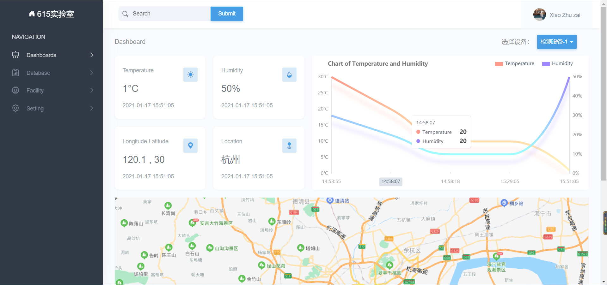
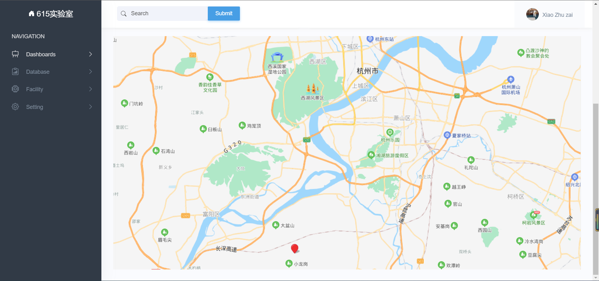
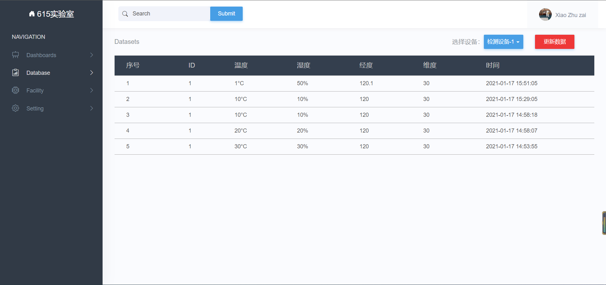
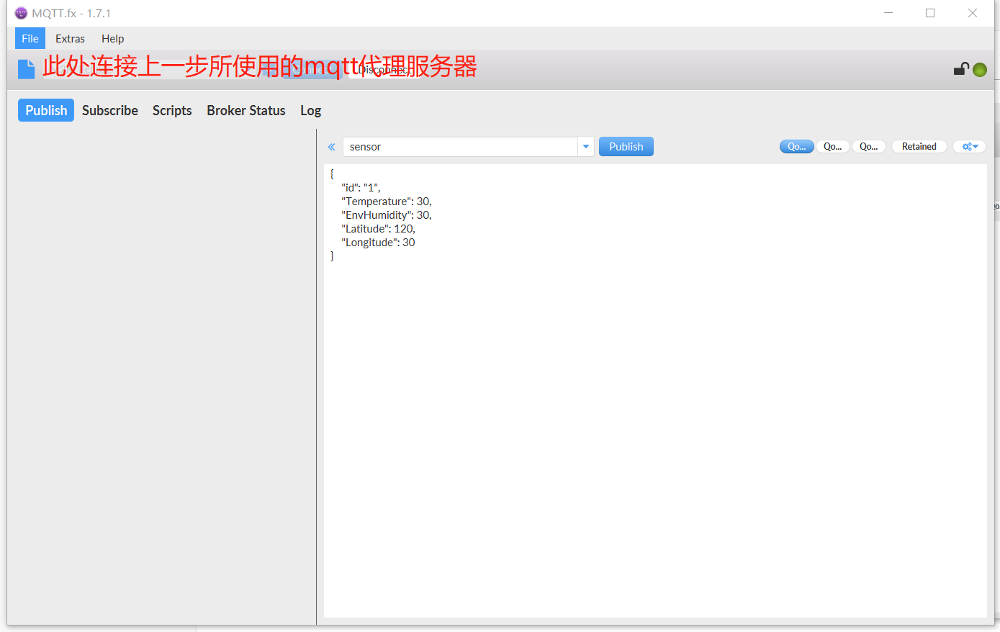

# IoT-web-Simple

### Overview

本项目是一个简单的物联网前端界面，用于展示终端设备检测的温度、湿度和经纬度信息。







### **核心技术**

- 后端：Node/Express	Mongodb/[Mongoose](http://www.mongoosejs.net/docs/api.html)   
- 前端：HTML CSS  [jQuery](https://jquery.cuishifeng.cn/)
- 其它：有问题参考官方文档
    - art-template：前后端模板渲染     官网
    - Bootstrap：界面UI      [官网](https://www.bootcss.com/)
    - Echarts：折线图     [官网](https://echarts.apache.org/examples/zh/index.html)
    - 百度地图：地图      [官网](http://lbsyun.baidu.com/index.php?title=jspopular)
    - mqtt包：接收终端数据    [npm网址](https://www.npmjs.com/package/mqtt)
    - mqtt代理服务器：别人做好的（不在本项目中） 可找一个mqtt服务器替代

### **运行准备工作**

* 需安装node和mongodb数据库
    * [linux下载mongodb](https://blog.csdn.net/qq_41107231/article/details/108028319)
    * [npm下载过慢问题](https://blog.csdn.net/qq_41107231/article/details/108028319)
* 导入相关包

```shell
npm i 
```

- /mqtt/subclient.js文件中需修改mqtt代理服务器ip地址

```js
let client2 = mqtt.connect("mqtt://????:1883");   //指定mqtt代理服务器
```

- /view/index.html文件中需修改百度地图AK，没有AK去百度地图官网注册即可

```html
<script src="//api.map.baidu.com/api?type=webgl&v=1.0&ak=填入你的AK"></script>
```

- 首先发送一条数据（可通过mqtt.fx模拟数据发送），不然数据库为空，页面显示将出现问题，数据格式如下



```sh
// 启动程序
node app.js
```

### **文件目录**

```js
-- app.js  			入口函数
-- router.js 		路由
-- package.json 	npm相关包
-- models 			数据库相关
	-- db.js		连接数据库
    -- Schema.js	设定Schema
-- public			公共资源
	-- css	
    -- image
    -- js
    	-- dataset	数据页面js文件
        -- index	主页js文件
        	main.js	主js文件
            options.js  折线图配置
    -- json
-- view				静态界面
	-- basic.html   基础页面
    -- index.html   主页
    -- dataset.html 数据页面
```

### 其它

本人初学前端，本页面主要是为了对接实验室另一个同学做的终端设备，页面做的比较简陋，可能也存在较多bug。

主要学习了B站上 [Node](https://www.bilibili.com/video/BV1Ns411N7HU?from=search&seid=13589243228352898605)  [jQuery](https://www.bilibili.com/video/BV17W41137jn?from=search&seid=17809054445315283160) 完成该网站

若想看完整网站 可访问47.111.122.217:9028（服务器不一定开启）   可联系本人

本人qq 2791655931 添加请注明来意 欢迎交流和指导  谢谢!

 